```{r, include = FALSE}
knitr::opts_chunk$set(
  collapse = TRUE,
  comment = "#>",
  eval = FALSE,
  fig.path = "man/figures/README-",
  out.width = "100%"
)
```

# retroglyph

> petroglyph, *n.* An image created by removing part of a rock surface by incising, picking, carving, or abrading, as a form of rock art. The term generally refers to rock engravings of ancient origin, often associated with prehistoric peoples. [@wikipedia2024petroglyph]

`retroglyph` reconstructs individual patient data from published Kaplan-Meier curve images.
Relative to other Kaplan-Meier reconstruction tools, it excels at untangling egregiously overplotted Kaplan-Meier curves, and the digitization phase achieves a high level of pixel precision.^[
  The algorithm by @guyot2012enhanced in the [`IPDfromKM`](https://CRAN.R-project.org/package=IPDfromKM) R package reconstructs individual patient survival data from a Kaplan-Meier pixel trace and its corresponding entries in the risk table.
  This happens downstream of the mentioned digitization phase.
  Use `agent$compare(data = "trace")` to check the pixel trace against the source image, and use `agent$compare(data = "survival")` to check the reconstructed survival data against the source image.
  `agent$compare(data = "censoring")` checks the reconstructed censoring times against the source image.
]

## Installation

To install the latest release version of `retroglyph`, open R and run:

```{r}
install.packages("pak")
pak::pak("wlandau/retroglyph@*release")
```

To install the development version of `retroglyph`:

```{r}
pak::pak("wlandau/retroglyph")
```

## App usage

The `retro_app()` function runs a Shiny app that lets you upload and process Kaplan-Meier images interactively.
Simply upload an image and prompt the model to reconstruct the data.

<table>
<tr>
<td align="center" width="50%">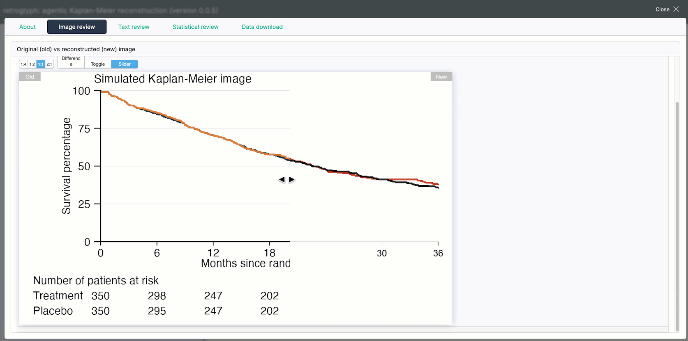<br><sub>Upload a Kaplan-Meier image.</sub></td>
<td align="center" width="50%">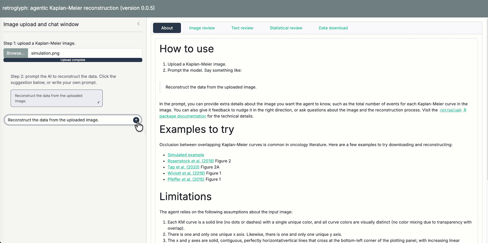<br><sub>Prompt the model to reconstruct the data.</sub></td>
</tr>
<tr>
<td align="center" width="50%">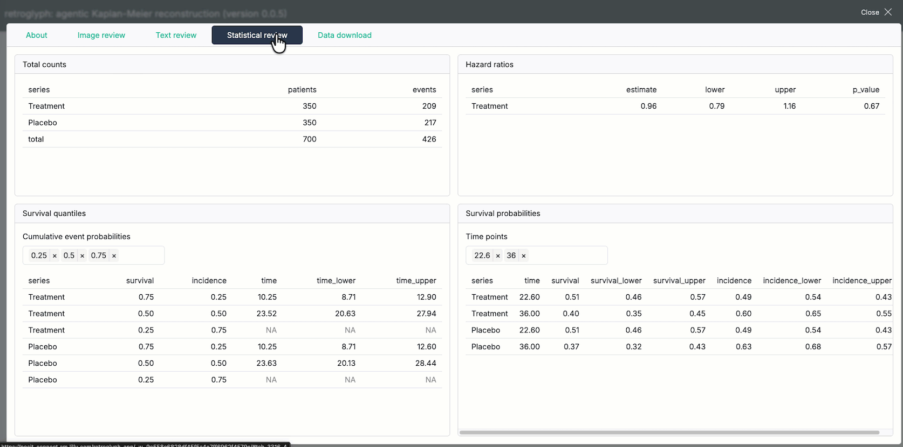<br><sub>Review the risk table and reconstructed survival statistics.</sub></td>
<td align="center" width="50%">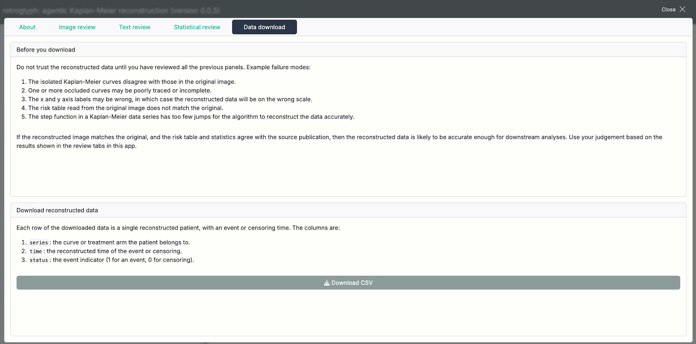<br><sub>Download the results.</sub></td>
</tr>
</table>

## Package usage

This section shows how to run `retroglyph` programmatically, which is useful for batch processing many images or building a custom web app of your own.

### Run the agent.

Start by creating an [`ellmer` chat object](https://ellmer.tidyverse.org/reference/index.html#chatbots) chat object with no registered tools and no system prompt.

```{r}
library(retroglyph)
chat <- ellmer::chat_anthropic(model = "sonnet", echo = "output")
```

Next, create a `retroglyph` agent object.

```{r}
agent <- retro_agent(chat)
```

Supply a Kaplan-Meier image file, with either survival probability or percentage of events on the vertical axis.
The following example uses a simulated Kaplan-Meier image, generated by the script at `system.file("simulation", "simulation.R", package = "retroglyph")`.
The treatment curve severely occludes the placebo curve, which often happens in oncology literature, e.g. @rosenstock2019carmelina Figure 2, @tap2020announce Figure 2A, @wiviott2019declare Figure 1, and @pfeffer2015elixa Figure 1.
Occlusion usually makes it difficult to reconstruct the underlying data, but `retroglyph` handles it easily using a novel Dijkstra-based path tracing algorithm (see "How `retroglyph` reconstructs data" later on).

```{r}
source <- system.file("simulation.png", package = "retroglyph")
```

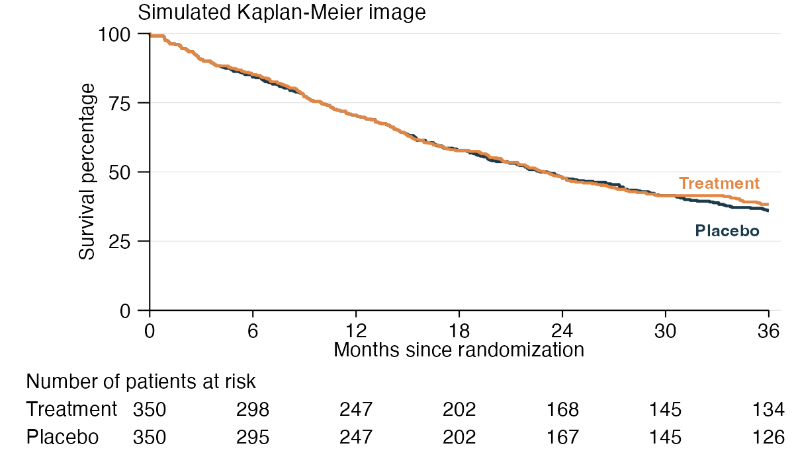

Call `reconstruct()` on the image path.
The agent calls the visual language model on tools that reconstruct the data.

```{r}
agent$reconstruct(source)
```

`reconstruct()` accepts an optional `prompt` argument for anything you know that the image does not show.
The most useful thing to put there is each Kaplan-Meier series' total number of events, which publications often report in the text rather than in the figure.
The agent is instructed to trust a number you state over anything it reads off the image, and a total event count sharpens the estimated censoring at the end of each series' follow-up.

```{r}
agent$reconstruct(
  source,
  prompt = paste(
    "The publication reports the total number of events",
    "in each Kaplan-Meier series.",
    "Fill in the counts it gives for the series in this figure."
  )
)
```

Only state a total you actually have.
A wrong total is worse than none, because it shifts the estimated censoring at the end of follow-up, and the agent is instructed never to guess one (in particular, never to derive one by counting censoring tick marks).

Alternatively, you can register the image separately and then use the chat to kick of the reconstruction process.
This is useful if you are building a web app on top of `retroglyph`.

```{r}
agent$register(source)
agent$chat$chat("Reconstruct the registered image.")
```

## Accessing results

Methods in the `agent` object allow you to access results.
Do not trust those results until you have reviewed the reconstructed image and risk table (see the next sections).

The `data()` method shows survival data reconstructed using the `IPDfromKM` R package, from the numbers at risk the model read off the image or took from your `prompt`.

```{r}
agent$data()
#> # A tibble: 700 × 3
#>    series     time status
#>    <chr>     <dbl>  <int>
#>  1 Treatment 0.288      1
#>  2 Treatment 0.327      1
#>  3 Treatment 0.327      1
#>  4 Treatment 0.327      1
#>  5 Treatment 0.827      1
#>  6 Treatment 0.865      1
#>  7 Treatment 0.865      1
#>  8 Treatment 0.904      1
#>  9 Treatment 0.904      1
#> 10 Treatment 1.13       1
#> # ℹ 690 more rows
#> # ℹ Use `print(n = ...)` to see more rows
```

The legend marks the reference series (usually the control group in a controlled study) with a `TRUE` in the `reference` column.

```{r}
agent$legend()
#> # A tibble: 2 × 3
#>   series    color      reference
#>   <chr>     <chr>      <lgl>
#> 1 Treatment chocolate3 FALSE
#> 2 Placebo   gray13     TRUE
```

At this point, you can run your own survival model on the reconstructed data with the survival time and censoring status of each patient.

### Interactive review

You as the user are responsible for reviewing the image processing results of `retroglyph` and determining if the reconstruction is adequate.
Example failure modes are:

1. The isolated Kaplan-Meier curves disagree with those in the original image.
1. One or more occluded curves may be poorly traced or incomplete.
1. The x and y axis labels may be wrong, in which case the reconstructed data will be on the wrong scale.
1. The numbers at risk read from the original image do not match the original.
1. The step function in a Kaplan-Meier data series has too few jumps for the algorithm by @guyot2012enhanced ([`IPDfromKM`](https://CRAN.R-project.org/package=IPDfromKM) R package) to reconstruct the data accurately.

The `compare()` method lets you check for these and other issues that the automated processing may have missed.
For each reconstructed patient-level survival curve, `compare(data = "survival")` (default) refits the reconstructed survival data using `survival::survfit()` to derive the Kaplan-Meier step function, then redraws it on a blank canvas with the same axes as the original image.
After it redraws all the curves and axes, it launches an HTML widget to compare the resulting reconstructed image against the target image.^[`compare(data = "trace")` is similar, but it redraws the upstream pixel trace instead of the downstream survival data. If there are problems in the reconstruction process, this allows users to distinguish between problems due to `retroglyph` (which usually show up in the trace) versus problems due to `IPDfromKM`, which only affect the downstream survival data.]
If the curves in the two figures match, then the reconstruction was successful.
`compare(data = "censoring")` refits the same curves but draws them one pixel wide with a short vertical tick at every reconstructed censoring time, so the censoring marks can be checked against the ones in the source figure.^[The thinning is what makes the ticks legible: a tick a couple of pixels tall disappears inside a curve drawn at the source figure's own line width.]
Matches are generally better for denser curves with more points, and worse for sparse curves with few points^[This may be an inherent limitation of the algorithm by @guyot2012enhanced in the [`IPDfromKM`](https://CRAN.R-project.org/package=IPDfromKM) R package, which is responsible for reconstructing patient-level survival data from a Kaplan-Meier pixel trace and its corresponding entries in the risk table.].

```{r}
agent$compare(front = 2)
```

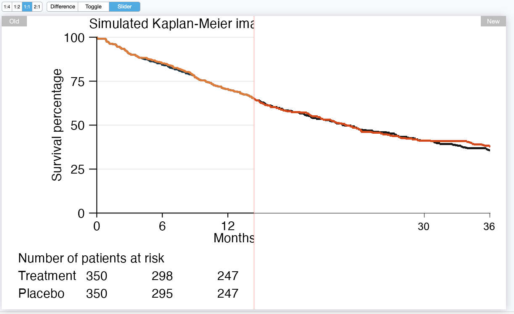

The `compare()` method supports a `front` argument to choose which curve to bring to the foreground.
This helps confirm that occluded curves were traced correctly.
In the following example, we bring the blue placebo curve to the foreground and verify that the agent overcame the overplotting in the original image.

```{r}
agent$compare(front = 1)
```

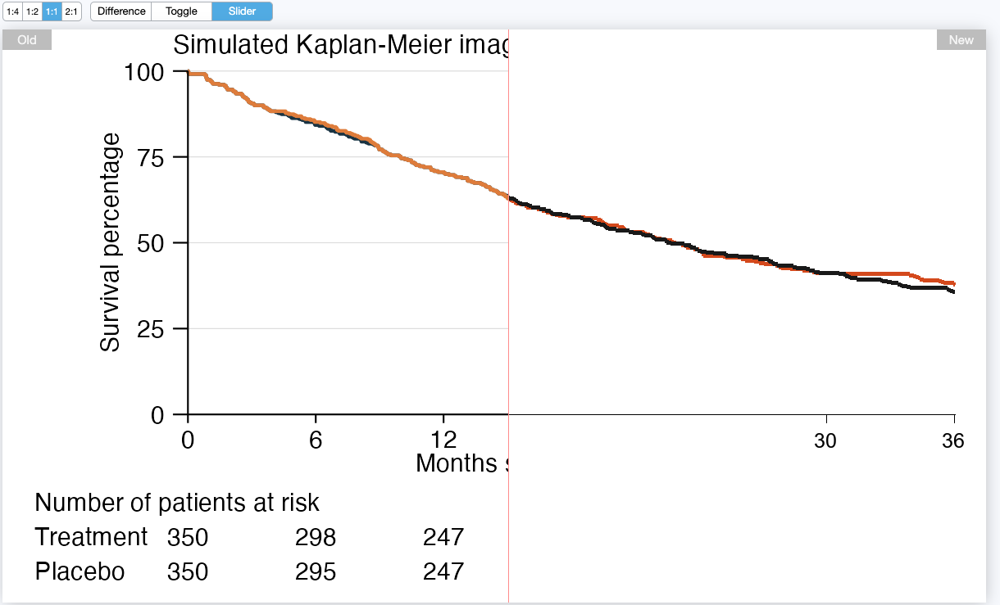

The `risk_table()` method shows the numbers at risk the model read from the source image or took from your `prompt`, at whatever time points were available (possibly as few as one per series).
These are an important input for reconstructing individual patient survival data, and the model reads them off the image visually, so only you can catch a misread digit.
If they match the source image, and if `agent$compare()` showed good agreement with the source, then the reconstructed data from `agent$data()` is likely to be accurate.

```{r}
agent$risk_table(mode = "transposed")
#> # A tibble: 2 × 8
#>   series      `0`   `6`  `12`  `18`  `24`  `30`  `36`
#>   <chr>     <int> <int> <int> <int> <int> <int> <int>
#> 1 Treatment   350   298   247   202   168   145   134
#> 2 Placebo     350   295   247   202   167   145   126
```

If the agent recorded a total number of events for any series, `events_table()` shows it.
This one is optional, so `NULL` here just means no series reported a total, not that anything went wrong.
Review it when it is present: it is a number the model either read off the image or took from your `prompt`, and it changes the reconstruction by sharpening the estimated censoring at the end of each series' follow-up.

```{r}
agent$events_table()
#> NULL
```

It is also good practice to check the hazard ratios and Kaplan-Meier quantiles of the reconstructed data against those reported in the original publication.
The `hazard_ratios()` method estimates hazard ratio of each series relative to the reference series using a simple proportional hazards model.

```{r}
agent$hazard_ratios()
#> # A tibble: 1 × 5
#>   series    estimate lower upper p_value
#>   <chr>        <dbl> <dbl> <dbl>   <dbl>
#> 1 Treatment    0.961 0.797  1.16   0.671
```

The `quantiles()` and `probabilities()` methods quantify regions of the estimated survival distribution.
`quantiles()` estimates the time points corresponding to a user-supplied set of survival (or optionally, incidence) probabilities, and `probabilities()` estimates the survival and incidence probabilities corresponding to a user-supplied set of time points.
Confidence intervals are also available for both methods.

```{r}
agent$quantiles(probabilities = c(0.5, 0.9))
#> # A tibble: 4 × 6
#>   series    survival incidence  time time_lower time_upper
#>   <chr>        <dbl>     <dbl> <dbl>      <dbl>      <dbl>
#> 1 Treatment      0.9       0.1  3.35       2.63       5.37
#> 2 Treatment      0.5       0.5 22.8       19.9       26.8
#> 3 Placebo        0.9       0.1  3.35       2.63       4.87
#> 4 Placebo        0.5       0.5 22.6       19.6       27.4
```

```{r}
agent$probabilities(quantiles = c(3, 22))
#> # A tibble: 4 × 8
#>   series     time survival survival_lower survival_upper incidence incidence_lower incidence_upper
#>   <chr>     <dbl>    <dbl>          <dbl>          <dbl>     <dbl>           <dbl>           <dbl>
#> 1 Treatment     3    0.906          0.876          0.937    0.0943           0.124           0.063
#> 2 Treatment    22    0.514          0.465          0.569    0.486            0.535           0.431
#> 3 Placebo       3    0.906          0.876          0.937    0.0943           0.124           0.063
#> 4 Placebo      22    0.509          0.459          0.564    0.491            0.541           0.436
```

## Batch processing

If you call `reconstruct()` on many images as part of a batch processing pipeline, you can use the `export` method to save the comparison widgets and results for each image.
The workflow could look something like this:

```{r}
library(retroglyph)
agent <- ellmer::chat_anthropic(model = "sonnet") |>
  retro_agent()
for (image in images) {
  agent$reconstruct(image)
  agent$export(fs::path_ext_set(image, ""))
}
```

`export()` saves the data and comparison widgets for a given image.
Example:

```{r}
agent$export("simulation", quantiles = c(3, 22))
fs::dir_tree("simulation")
#> simulation
#> ├── compare
#> │   ├── placebo_gray13.html
#> │   └── treatment_chocolate3.html
#> └── data
#>     ├── counts.csv
#>     ├── data.csv
#>     ├── hazard_ratios.csv
#>     ├── probabilities.csv
#>     ├── quantiles.csv
#>     └── risk_table.csv
```

The files in `simulation/compare/` are HTML widgets generated by `agent$compare()`.

* `treatment_chocolate3.html`: a reconstructed image with the treatment curve shown as the `chocolate3` color in the foreground.
* `placebo_gray13.html`: a reconstructed image with the Placebo curve shown as the `gray13` color in the foreground.

The data in `simulation/data/` are CSV files generated by `agent$data()`, `agent$hazard_ratios()`, `agent$probabilities()`, `agent$quantiles()`, `agent$risk_table()`, and `agent$events_table()`.

* `data.csv`: reconstructed individual patient data, with survival time and censoring status for each patient.
* `events_table.csv`: the total number of events in each series, when the agent recorded any.
* `hazard_ratios.csv`: the hazard ratio of each series relative to the reference series.
* `probabilities.csv`: reconstructed individual patient data, with survival probabilities at specified time points (quantiles).
* `quantiles.csv`: Kaplan-Meier survival quantiles (e.g. median survival) for each series.
* `risk_table.csv`: the numbers at risk read from the original image or taken from your `prompt`, at whatever time points were available.

Remarks:

* The reference series is identified in the legend by the `reference` column (`TRUE` for that series). Hazard ratios are computed relative to it; when the curves do not represent treatment arms, this is simply the denominator for the ratio.
* Every image needs at least one number at risk per data series (see [Limitations](#limitations)). If the model determines the source image has none and you supplied none, it stops before calling the distill or data tools, and none of these files are produced.
* Total events, by contrast, is optional. `events_table.csv` is simply absent when no series reported a total, which is common and not an error.

## How `retroglyph` reconstructs data

The `reconstruct()` method prompts the model to run four [agent tools](https://ellmer.tidyverse.org/reference/tool.html) in the following order.
Within each tool, `retroglyph` divides the work among the visual language model and hard-coded [tools](https://ellmer.tidyverse.org/reference/tool.html), each according to their respective strengths.
The model makes high-level judgment calls during the pipeline, and hard-coded tools compute precise answers once those judgment calls are made.

1. **The "Quantize" tool**.
  The model calls this tool first, before anything else, and exactly once: it takes no arguments, so a second call would return an identical result.
  It reduces the source image to at most 256 colors using [`magick::image_quantize()`](https://docs.ropensci.org/magick/reference/color.html) and returns the quantized image.
  The model reads color codes for the distill tool's color arguments by eye from this simplified image, rather than from the full-color original.

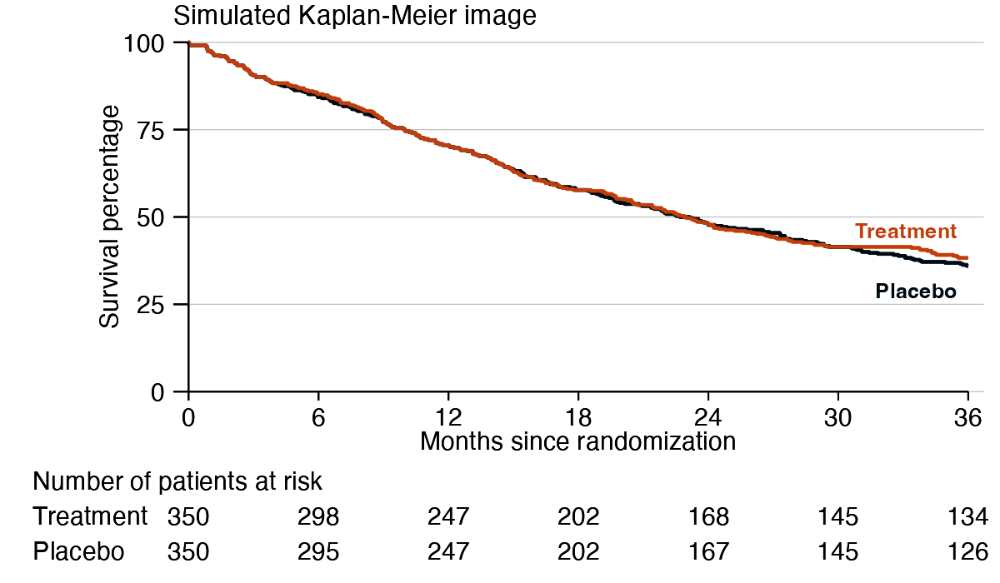

2. **The "Label" tool**.
  The model calls this tool second, right after quantize, and exactly once: it takes no arguments and always runs with the same fixed OCR settings, so a second call would return an identical result.
  It returns one image: a grayscale annotated copy of the source with set-of-mark labels, a technique called [set-of-mark prompting](https://arxiv.org/abs/2310.11441).
  The [`tesseract`](http://docs.ropensci.org/tesseract/) package uses OCR to detect the positions of numbers in the image^[[`tesseract`](http://docs.ropensci.org/tesseract/) passes on the recognized text at those positions to the language model, and then the latter makes the final judgment call on what the numbers are.],
  and then the [`magick`](http://docs.ropensci.org/magick/) package marks those numbers with letter labels and bounding boxes.
  As soon as it sees the source image, the model checks whether the numbers at risk are available (see [Limitations](#limitations)). Every curve needs at least one, from the figure or from your `prompt`, and the model stops immediately, without calling any other tool, if a curve has none.

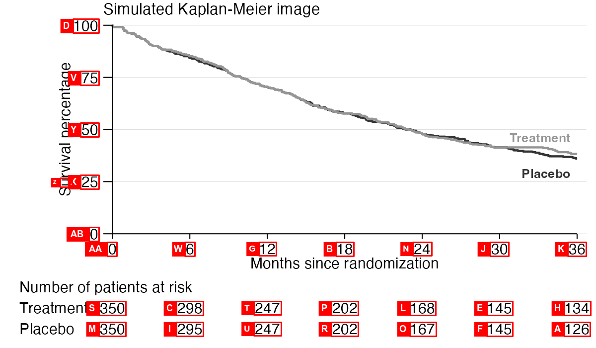

3. **The "Distill" tool**.
  This tool reduces the image to nothing but its Kaplan-Meier curves on a flat background.
  The processing steps are as follows:
    * **Panel isolation**: Using the annotated image from the previous tool, the visual language model selects two tick labels for each axis and reads their numeric values.
    The values and locations of the tick labels define the plotting scales.
    Using those scales, the tool locates the origin, searches and detects the axis lines in a small region around the origin, and erases the plotting panel border lines/axes and everything outside them. 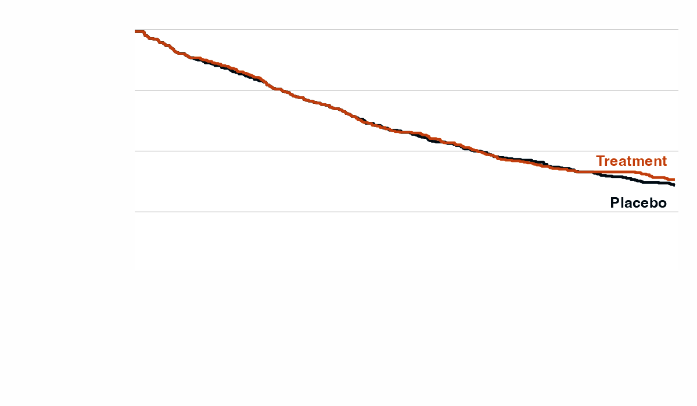
    * **Curve isolation**: The visual language model supplies the tool with color codes for the various elements of the image: the background color, a list of garbage colors for undesired elements, and one color per Kaplan-Meier curve.
    [`magick::image_map()`](https://docs.ropensci.org/magick/reference/color.html) maps each pixel's color to the nearest color in the model-supplied palette, and then garbage colors are assigned to background.
    Finally, the tool removes any connected components that are too short to be Kaplan-Meier curves, such as legend keys and text fragments.
    The result is a *distilled* image with only the Kaplan-Meier curves on a flat background:

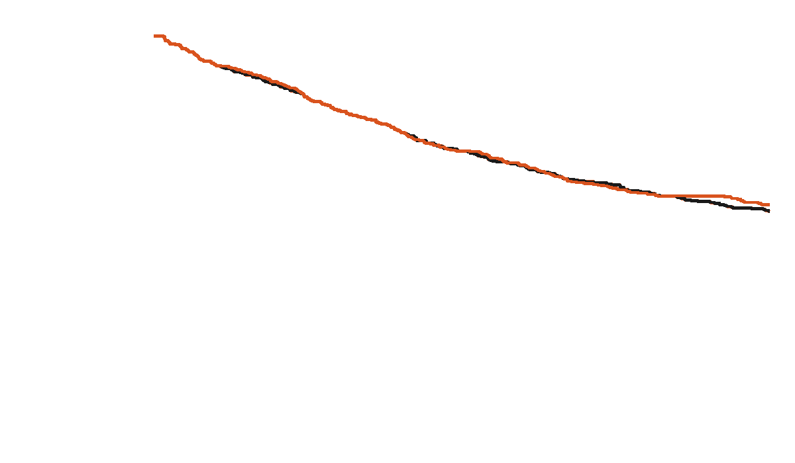

4. **The "Data" tool**.
  This tool converts the isolated curves into patient-level survival data.
  Processing steps:
    * **Curve disentanglement**: plotted Kaplan-Meier curves often overlap and occlude one another.
    To reconstruct a full curve, this step traces a path that connects visible pixels through occluded ones.
        * **Adjacency graph**:
    First, the tool builds an adjacency graph where each Kaplan-Meier pixel is a vertex connected to all its adjacent non-background neighbors.
    The edges connecting adjacent pixels have numeric weights.
    We give small weights to edges between pixels on the target curve, large weights to edges between pixels on non-target curves, and intermediate weights to edges between a target and non-target pixel.
    The adjacency graph pictorially resembles the contents of the magnifying glass in the following image, which assumes we are targeting the blue curve: 
        * **Endpoints**: Next, for the target curve, we identify the leftmost and rightmost pixels as the start and end vertices of the path, taking care to ignore small anti-aliasing artifacts when detecting the rightmost pixel.
        * **Shortest path**: [Dijkstra's shortest path algorithm](https://en.wikipedia.org/wiki/Dijkstra%27s_algorithm) finds the shortest path between these endpoints through the graph, which is the most likely path that the target curve would have shown in the absence of overplotting: 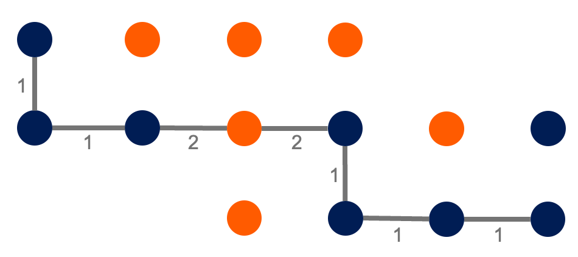
        * **Line centering**: Finally, to counteract bias from the line width, a light touch of image morphology tweaks local regions of the line to more accurately trace the middle of the original curve^[See `retroglyph:::retro_path_claim_pixels()`.].
        Whereas the Dijkstra's path tends to "hug the turns" of the foreground mask of Kaplan-Meier ink, the line centering step shifts the path to more accurately trace the middle of the original curve. 
    * **Data reconstruction**: After resolving overplotting, the tool supplies the skeletonized curve traces and the model-supplied numbers at risk (read from the source image or taken from your `prompt`) to the `IPDfromKM` R package.
    The `IPDfromKM` package uses the algorithm by @guyot2012enhanced to reconstruct individual patient survival data from the Kaplan-Meier pixel traces and the numbers at risk.
    If a series' total number of events is also available - either stated in your `prompt` or printed in the figure - the tool passes that along too, which sharpens the estimated censoring at the end of that series' follow-up.

## Limitations

The agent relies on the following assumptions about the input image:

1. Each KM curve is a solid line (no dots or dashes) with a single unique color, and all curve colors are visually distinct (no color mixing due to transparency with overlap).
1. There is one and only one unique x axis. Likewise, there is one and only one unique y axis.
1. The x and y axes are solid, contiguous, perfectly horizontal/vertical lines that cross at the bottom-left corner of the plotting panel, with increasing linear scales.
1. The y axis is survival or cumulative incidence, on a probability or percentage scale.
1. At least one number at risk is available for each KM curve, from the figure or from your `prompt`. A full risk table is ideal but not required: each curve's total number of patients, a starting and ending sample size, or any other subset all work, though sparser numbers warrant more scrutiny of the result.
1. The image text must be clear and detailed enough for OCR to read the axis tick labels and whatever numbers at risk the figure provides. This requires high enough resolution and large enough font.

Most published Kaplan-Meier images satisfy all these assumptions.

## Troubleshooting

If data reconstruction fails, a retry in a fresh session often fixes the issue because the underlying visual language model is stochastic.
If the error is persistent and you believe `retroglyph` should be able to support the image, please [file an issue](https://github.com/wlandau/retroglyph/issues) and share details that help with troubleshooting (the image, the error message, etc).

## Related work

Reconstructing individual patient data from Kaplan-Meier curves is a well-established need in meta-analysis.
The foundational algorithm by @guyot2012enhanced extracts coordinates from digitized curves and combines them with published at-risk tables to reconstruct time-to-event data.
Tools like [WebPlotDigitizer](https://apps.automeris.io/wpd4/) and [xyscan](https://packagehub.suse.com/packages/xyscan/) assist with the manual digitization step, requiring users to click on curve coordinates by hand.

More recently, @zhao2025kmgptautomatedpipelinereconstructing (KM-GPT) demonstrated a fully automated pipeline using OpenAI's GPT models to extract coordinates directly from Kaplan-Meier images.
It uses the visual language models and OCR to interpret Kaplan-Meier-specific features of images, and it uses a classic K-medoids-based algorithm to isolate and find paths.

## Code of Conduct

Please note that the `retroglyph` project is released with a [Contributor Code of Conduct](https://github.com/wlandau/retroglyph/blob/main/CODE_OF_CONDUCT.md). By participating in this project you agree to abide by its terms.

## References
